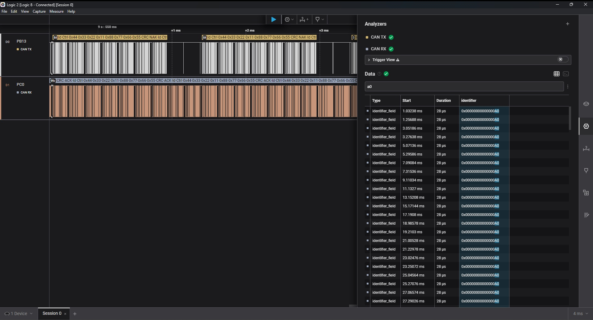
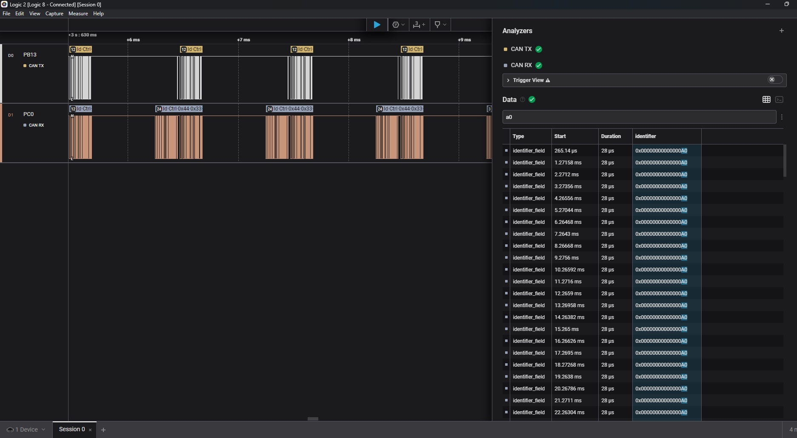

# Noah and Thomas CAN bus lab

## Observations for final activity

It was observed that the CAN control gives an opportunity for a lower priority message to happen every couple milliseconds. Looking at the logic analyzer when just transmitting as fast as possible there were "quiet" periods every couple milliseconds. We assume that this is to prevent a babbling nodes from completely dominating. In order to show that babbling nodes affect a lower priority message, we had to make a the lower priority message occur frequently, we chose a period of 1ms. The below screenshot shows the effects of the babbling node on our low priority node.

After adding a small delay to the high priority side we were able to see consistant reception of the low priority message.

